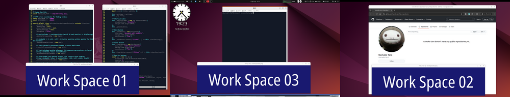

# NamakeWM

A GNOME Shell extension that enables independent workspace management for each monitor, inspired by Spectrwm/Herbstluftwm-style workspace handling.




## Features

- **Independent Workspaces per Monitor**: Each monitor can display a different workspace simultaneously
- **Workspace Swap**: When switching to a workspace already shown on another monitor, workspaces are swapped between monitors
- **Per-Workspace Wallpapers**: Set different wallpapers for each workspace, with scaling and tiling options
- **Workspace Indicator**: Shows current workspace number for each monitor in the top panel
- **Popup Banner**: Brief notification when switching workspaces or displays
- **Focus Management**: Automatically focuses windows under the pointer, with focus restoration on workspace switch
- **Window/Display Highlight**: Draw colored lines on edges of focused window or current display
- **Customizable Keybindings**: Configure modifier keys (Alt/Super/Ctrl) and custom shortcuts

## Supported Versions

- GNOME Shell 45, 46, 47

## Prerequisites

This extension requires the following GNOME settings:

| Setting | Required Value | Description |
|---------|---------------|-------------|
| `workspaces-only-on-primary` | `true` | Workspaces on primary display only |
| `dynamic-workspaces` | `false` | Fixed number of workspaces |

The extension will prompt to apply these settings automatically on first enable.

## Installation

### From GNOME Extensions (Recommended)

<!-- Add URL after publishing
Install with one click from [GNOME Extensions](https://extensions.gnome.org/extension/XXXX/namakewm/).
-->

*Coming soon*

### Manual Installation

1. Clone the repository

```bash
git clone https://github.com/namake-taro/gnome-namakewm.git
cd gnome-namakewm
```

2. Copy to extensions directory

```bash
mkdir -p ~/.local/share/gnome-shell/extensions/gnome-namakewm@namake-taro.github.io
cp -r ./* ~/.local/share/gnome-shell/extensions/gnome-namakewm@namake-taro.github.io/
```

3. Compile schemas

```bash
glib-compile-schemas ~/.local/share/gnome-shell/extensions/gnome-namakewm@namake-taro.github.io/schemas/
```

4. Restart GNOME Shell
   - **Wayland**: Log out and log back in
   - **X11**: Press `Alt+F2`, type `r`, press `Enter` (see [Known Limitations](#known-limitations) if already enabled)

5. Enable the extension

```bash
gnome-extensions enable gnome-namakewm@namake-taro.github.io
```

Or enable it from the Extensions app.

## Usage

### Default Keybindings

| Key | Action |
|-----|--------|
| `Alt+1` ~ `Alt+9`, `Alt+0` | Switch workspace on current monitor (WS1-WS9, WS10) |
| `Alt+Shift+1` ~ `Alt+Shift+0` | Move focused window to workspace |

### Workspace Behavior

- **Simple Switch**: When target workspace is not displayed on any monitor, simply switch to it
- **Swap**: When target workspace is already shown on another monitor, swap workspaces between the two monitors

Example:
```
Initial:  Monitor0=WS1, Monitor1=WS2, Monitor2=WS3
Action:   On Monitor0, press Alt+2 (switch to WS2)
Result:   Monitor0=WS2, Monitor1=WS1, Monitor2=WS3 (WS1 and WS2 swapped)
```

## Configuration

Open settings from the Extensions app, or run:

```bash
gnome-extensions prefs gnome-namakewm@namake-taro.github.io
```

### Behavior Settings

| Setting | Description | Default |
|---------|-------------|---------|
| Workspace Indicator | Show workspace numbers in top panel | On |
| Popup Banner | Show notification on workspace/display change | On |
| Warp Pointer to Focus | Move pointer to window center on focus change | On |
| Raise Window on Cycle Focus | Raise window when cycling focus | On |
| Warp to Workspace Instead of Swap | Move pointer instead of swapping workspaces | Off |

### Keybinding Settings

| Setting | Description | Default |
|---------|-------------|---------|
| Modifier Key | Modifier for workspace shortcuts | Alt |
| Cycle Focus Forward/Backward | Cycle through windows in current workspace | - |
| Swap Window Forward/Backward | Swap window position with next/previous | - |
| Warp to Monitor N | Move pointer to monitor center | - |

### Highlight Settings

| Setting | Description | Default |
|---------|-------------|---------|
| Window Highlight | Draw lines on focused window edges | Off |
| Display Highlight | Draw lines on current display edges | Off |
| Line Thickness | Thickness in pixels | 3 |
| Color | Line color | Red/Green |

### Wallpaper Settings (Wallpapers tab)

| Setting | Description | Default |
|---------|-------------|---------|
| Enable Per-Workspace Wallpapers | Enable workspace-specific wallpapers | Off |
| Wallpaper Groups | Configure wallpaper for specific workspaces | - |

#### Wallpaper Group Options

Each wallpaper group allows you to:
- **Select Workspaces**: Choose which workspaces use this wallpaper (multiple selection)
- **Choose Image**: Select any image file (JPEG, PNG, WebP, BMP)
- **Scale to Fit**: Scale image to cover the screen (maintains aspect ratio)
- **Tile**: Repeat the image to fill the screen (image center aligns with screen center)

When a workspace has no assigned wallpaper, the system wallpaper is displayed.

## Known Limitations

### GNOME Shell Restart (Alt+F2 → r)

When restarting GNOME Shell using `Alt+F2` → `r` (X11 only), windows on secondary monitors may not be restored correctly. This is because the extension's `disable()` function is not called before the shell restarts.

**Workaround**: Before restarting GNOME Shell, disable the extension first:

```bash
gnome-extensions disable gnome-namakewm@namake-taro.github.io
# Then restart GNOME Shell (Alt+F2 → r)
# After restart, re-enable the extension
gnome-extensions enable gnome-namakewm@namake-taro.github.io
```

Note: Screen lock/unlock works correctly without any workaround.

## Debugging

Enable debug mode in settings to log to `/tmp/mmw-debug.log`:

```bash
tail -f /tmp/mmw-debug.log
```

## Uninstall

```bash
gnome-extensions disable gnome-namakewm@namake-taro.github.io
rm -rf ~/.local/share/gnome-shell/extensions/gnome-namakewm@namake-taro.github.io
```

## License

GPL-3.0

## Author

[@namake-taro](https://github.com/namake-taro)
